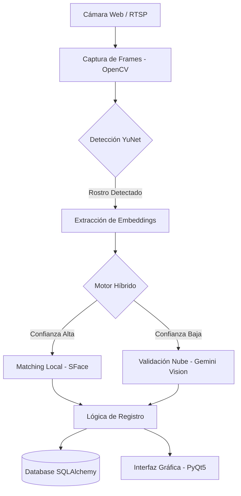

<p align="center">
  
</p>

<h1 align="center">🛡️ Safe Link Monitoring - Control de Asistencia v2.0.4</h1>

<p align="center">
  <strong>Sistema inteligente de escritorio para el registro biométrico facial de personal en tiempo real.</strong>
</p>

<p align="center">
  
  
  
  
  
</p>

---

## 📋 Descripción General

**Safe Link Monitoring - Control de Asistencia** es una solución de grado empresarial diseñada para automatizar el ciclo de asistencia (Check-In / Check-Out) mediante **biometría facial avanzada**. 

A diferencia de sistemas convencionales, esta aplicación utiliza un **motor híbrido** que combina la velocidad local de OpenCV con la potencia de razonamiento visual de **Google Gemini Pro Vision**, garantizando precisión incluso en condiciones de iluminación difíciles o cambios de apariencia en el trabajador.

---

## ✨ Características Premium

### 🧠 Inteligencia Artificial Híbrida
- **Motor Primario (OpenCV SFace/YuNet)**: Reconocimiento ultra-rápido (< 200ms) para condiciones estándar.
- **Motor Secundario (Gemini AI)**: Validación cruzada de alta fidelidad cuando la confianza local es baja.
- **Self-Healing AI**: El sistema aprende de los embeddings diarios del personal para mejorar la precisión sin intervención manual.

### 🎨 Interfaz de Usuario (UX/UI)
- **Diseño Glassmorphism**: Interfaz moderna y profesional basada en el ecosistema Safe Link.
- **Micro-interacciones**: Transiciones fluidas, splash screens animados y notificaciones visuales claras de éxito/error.
- **Dashboard en Vivo**: Visualización en tiempo real de la captura de cámara con superposiciones inteligentes de detección.

### 🔐 Seguridad y Cumplimiento
- **Autenticación Bcrypt**: Gestión segura de credenciales administrativas.
- **Persistencia Local**: Base de datos integrada con SQLAlchemy (SQLite/MySQL) para funcionamiento offline y sincronización posterior.
- **Logs de Auditoría**: Registro detallado de cada intento de acceso y evento del sistema.

---

## 🏗️ Arquitectura del Sistema

El sistema se divide en capas modulares para facilitar el mantenimiento y escalabilidad:



---

## 🚀 Guía de Instalación Robusta

### 1. Preparación del Entorno
Se recomienda utilizar **Python 3.10** para máxima compatibilidad con modelos de visión.

```powershell
# Clonar y entrar al proyecto
git clone https://github.com/Safe-LM/app-login-trabajadores-desktop.git
cd app-login-trabajadores-desktop

# Crear y activar entorno virtual
python -m venv venv
.\venv\Scripts\Activate.ps1
```

### 2. Instalación de Dependencias
Ejecute el script de instalación automática o use pip directamente:

```powershell
# Opción A: Automatizado (Recomendado)
.\iniciar.ps1

# Opción B: Manual
pip install --upgrade pip
pip install -r requirements.txt
```

### 3. Configuración de API Keys
Para activar el motor de **Gemini AI**, cree un archivo `.env` en el directorio raíz:

```env
GEMINI_API_KEY=tu_api_key_de_google_ai_studio
LOG_LEVEL=INFO
DB_URL=sqlite:///database/asistencia.db
```

---

## 📖 Guía de Uso

1. **Inicialización**: Ejecute `python main.py` o use el acceso directo `ejecutar.ps1`.
2. **Autenticación**: Ingrese con las credenciales administrativas para acceder al Dashboard.
3. **Mantenimiento de Base de Datos**: 
   - Use `setup_fotos.py` para preparar las fotos de perfil de los empleados.
   - Use `train_face_recognition_opencv.py` para regenerar los modelos locales si agrega personal nuevo.
4. **Operación**: Posicione el rostro frente a la cámara. El sistema indicará en pantalla cuando el reconocimiento sea exitoso y registrará el timestamp automáticamente.

---

## 📂 Organización del Proyecto

```text
├── 🛠️ main.py                      # Punto de entrada de la aplicación
├── ⚙️ config_gemini.py              # Gestión de variables y API Gemini
├── 📊 train_face_recognition_opencv.py # Script de entrenamiento local
├── 🚀 ejecutar.ps1                  # Lanzador rápido para Windows
├── 📦 utils/                         # Núcleo lógico del sistema
│   ├── face_recognition_opencv.py   # Motor de visión local
│   ├── gemini_vision_matcher.py     # Integración con Google AI
│   ├── hybrid_opencv_gemini_matcher.py # Lógica de decisión híbrida
│   └── auth.py                      # Seguridad y sesiones
├── 🖼️ windows/                      # Capa de presentación (PyQt5)
│   ├── login_window.py              # Gestión de acceso
│   └── dashboard_window.py          # Interfaz principal de monitoreo
└── 💾 database/                     # Almacenamiento y modelos de datos
```

---

## 🔧 Solución de Problemas Comunes

| Error | Causa Probable | Solución |
|-------|----------------|----------|
| **Error 429 (Quota Exceeded)** | Límite de API Gemini alcanzado. | El sistema cambiará automáticamente a solo OpenCV. Verifique su cuenta en Google AI Studio. |
| **DLL Load Failed (PyTorch/CV2)** | Falta de C++ Redistributable o venv corrupto. | Instale "Microsoft Visual C++ Redistributable" y reinicie el VS Code. |
| **No se detecta cámara** | Cámara en uso por otra app (Teams, Zoom). | Cierre la otra aplicación y presione "Activar Cámara" en el dashboard. |

---

## 📄 Licencia y Créditos

Este software es **Propiedad Privada** de **Safe Link Monitoring**. Queda prohibida su reproducción o distribución sin autorización expresa.

<p align="center">
  <sub>Desarrollado con ❤️ por el equipo de Ingeniería de Safe Link Monitoring</sub>
</p>
