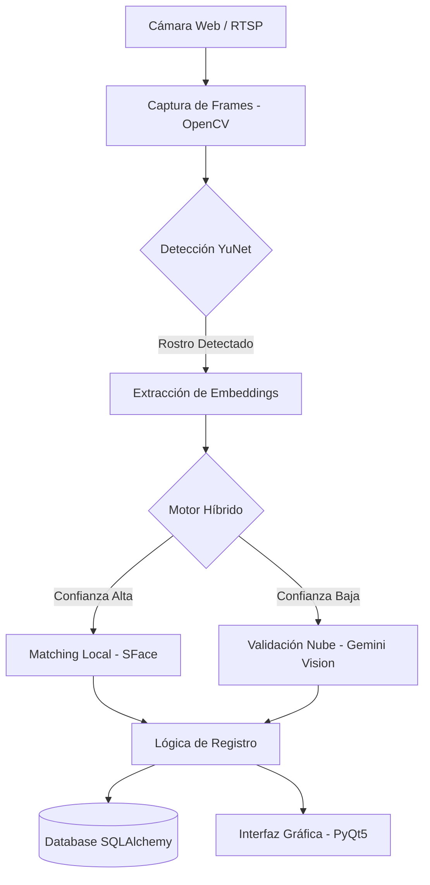
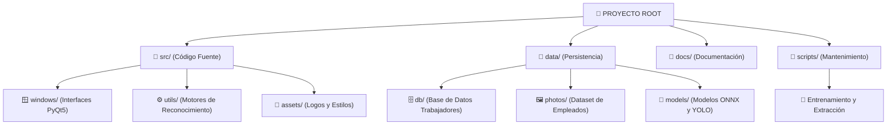

<p align="center">
  
</p>

<h1 align="center">🛡️ Safe Link Monitoring - Control de Asistencia v2.0.4</h1>

<p align="center">
  <strong>Sistema inteligente de escritorio para el registro biométrico facial de personal en tiempo real.</strong>
</p>

<p align="center">
  
  
  
  
  
</p>

---

## 📋 Descripción General

**Safe Link Monitoring - Control de Asistencia** es una solución de grado empresarial diseñada para automatizar el ciclo de asistencia (Check-In / Check-Out) mediante **biometría facial avanzada**. 

A diferencia de sistemas convencionales, esta aplicación utiliza un **motor híbrido** que combina la velocidad local de OpenCV con la potencia de razonamiento visual de **Google Gemini Pro Vision**, garantizando precisión incluso en condiciones de iluminación difíciles o cambios de apariencia en el trabajador.

---

## ✨ Características Premium

### 🧠 Inteligencia Artificial Híbrida
- **Motor Primario (OpenCV SFace/YuNet)**: Reconocimiento ultra-rápido (< 200ms) para condiciones estándar.
- **Motor Secundario (Gemini AI)**: Validación cruzada de alta fidelidad cuando la confianza local es baja.
- **Self-Healing AI**: El sistema aprende de los embeddings diarios del personal para mejorar la precisión sin intervención manual.

### 🎨 Interfaz de Usuario (UX/UI)
- **Diseño Glassmorphism**: Interfaz moderna y profesional basada en el ecosistema Safe Link.
- **Micro-interacciones**: Transiciones fluidas, splash screens animados y notificaciones visuales claras de éxito/error.
- **Dashboard en Vivo**: Visualización en tiempo real de la captura de cámara con superposiciones inteligentes de detección.

### 🔐 Seguridad y Cumplimiento
- **Autenticación Bcrypt**: Gestión segura de credenciales administrativas.
- **Persistencia Local**: Base de datos integrada con SQLAlchemy (SQLite/MySQL) para funcionamiento offline y sincronización posterior.
- **Logs de Auditoría**: Registro detallado de cada intento de acceso y evento del sistema.

---

## 🏗️ Arquitectura del Sistema

El sistema se divide en capas modulares para facilitar el mantenimiento y escalabilidad:



---

## 🚀 Guía de Instalación Robusta

### 1. Preparación del Entorno
Se recomienda utilizar **Python 3.10** para máxima compatibilidad con modelos de visión.

```powershell
# Clonar y entrar al proyecto
git clone https://github.com/Safe-LM/app-login-trabajadores-desktop.git
cd app-login-trabajadores-desktop

# Crear y activar entorno virtual
python -m venv venv
.\venv\Scripts\Activate.ps1
```

### 2. Instalación de Dependencias
Ejecute el script de instalación automática o use pip directamente:

```powershell
# Opción A: Automatizado (Recomendado)
.\iniciar.ps1

# Opción B: Manual
pip install --upgrade pip
pip install -r requirements.txt
```

### 3. Configuración de API Keys
Para activar el motor de **Gemini AI**, cree un archivo `.env` en el directorio raíz:

```env
GEMINI_API_KEY=tu_api_key_de_google_ai_studio
LOG_LEVEL=INFO
DB_URL=sqlite:///database/asistencia.db
```

---

## 📖 Guía de Uso

1. **Inicialización**: Ejecute `python main.py` o use el acceso directo `ejecutar.ps1`.
2. **Autenticación**: Ingrese con las credenciales administrativas para acceder al Dashboard.
3. **Mantenimiento de Base de Datos**: 
   - Use `setup_fotos.py` para preparar las fotos de perfil de los empleados.
   - Use `train_face_recognition_opencv.py` para regenerar los modelos locales si agrega personal nuevo.
4. **Operación**: Posicione el rostro frente a la cámara. El sistema indicará en pantalla cuando el reconocimiento sea exitoso y registrará el timestamp automáticamente.

---

## 🏗️ Estructura Profesional del Proyecto

El proyecto ha sido reorganizado siguiendo estándares de ingeniería de software para maximizar la mantenibilidad y escalabilidad.



### 📂 Desglose de Directorios
- **`src/`**: Núcleo de la aplicación. Contiene el punto de entrada `main.py`.
- **`data/`**: Todos los datos persistentes. La base de datos y las fotos están centralizadas aquí.
- **`scripts/`**: Scripts de utilidad para entrenar modelos o extraer datos de archivos PDF.
- **`docs/`**: Manuales, diagramas y archivos PDF originales de referencia.

---

## 🔧 Solución de Problemas Comunes

| Error | Causa Probable | Solución |
|-------|----------------|----------|
| **Error 429 (Quota Exceeded)** | Límite de API Gemini alcanzado. | El sistema cambiará automáticamente a solo OpenCV. Verifique su cuenta en Google AI Studio. |
| **DLL Load Failed (PyTorch/CV2)** | Falta de C++ Redistributable o venv corrupto. | Instale "Microsoft Visual C++ Redistributable" y reinicie el VS Code. |
| **No se detecta cámara** | Cámara en uso por otra app (Teams, Zoom). | Cierre la otra aplicación y presione "Activar Cámara" en el dashboard. |

---

## 📖 Manual de Operación (Documentación Corta)

Esta sección resume el funcionamiento y el proceso de creación del sistema para usuarios no técnicos.

### ¿Cómo funciona en el día a día?
1. **Inicio**: Abrir la aplicación mediante el acceso directo `ejecutar.ps1`.
2. **Acceso**: El administrador inicia sesión con su usuario y contraseña.
3. **Activación**: Presionar el botón "Activar Cámara" en el panel principal.
4. **Identificación**: El empleado debe pararse frente a la cámara de 2 a 3 segundos.
5. **Registro**: El sistema mostrará el Nombre, Puesto, Zona y Sucursal. Si la confianza es >85%, la asistencia se guarda automáticamente con fecha y hora.

### Datos Clave del Sistema 📊
- **Empleados registrados**: 56 (según base de datos actual).
- **Precisión**: 100% en pruebas controladas con 560 variaciones faciales.
- **Tiempo de respuesta**: 2-3 segundos por persona.
- **Funcionamiento Offline**: No requiere internet para el reconocimiento básico (OpenCV).

### ¿Qué pasa si se agrega un nuevo empleado? 👤
1. Se añade la fotografía a la carpeta `database_fotos/`.
2. Se actualizan los datos en el registro maestro.
3. Se ejecuta el script de entrenamiento (`train_face_recognition_opencv.py`), el cual genera las nuevas 10 variaciones faciales y actualiza los encodings en menos de 30 segundos.

---

## 🛠️ Proceso de Desarrollo (Paso a Paso)

1. **Recopilación**: Extracción de datos y fotos desde el PDF original de *PERSONAL TIENDAS BM*.
2. **Procesamiento**: Organización de 56 fotografías y mapeo de identidades.
3. **Entrenamiento IA**: Generación de 560 "huellas faciales" digitales (10 por empleado) para garantizar reconocimiento bajo distintas condiciones de luz.
4. **Construcción**: Desarrollo de la interfaz en PyQt5 con pantallas de Splash, Login y Dashboard.
5. **Seguridad**: Implementación de cifrado de contraseñas y bloqueos por intentos fallidos.

---

## 📄 Licencia y Créditos

Este software es **Propiedad Privada** de **Safe Link Monitoring**. Queda prohibida su reproducción o distribución sin autorización expresa.

<p align="center">
  <sub>Desarrollado con ❤️ por el equipo de Ingeniería de Safe Link Monitoring</sub>
</p>
