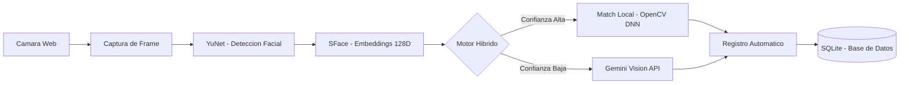
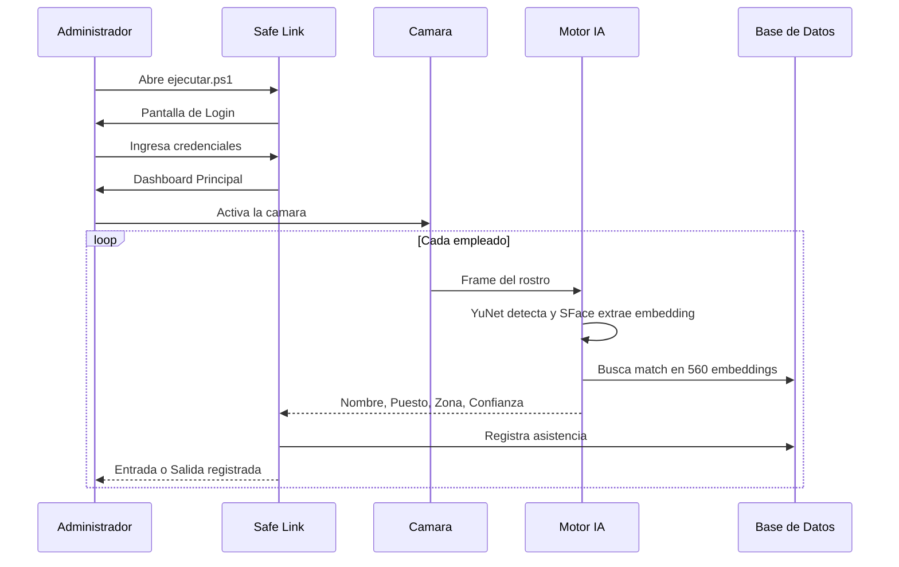

<p align="center">
  
  <br><br>
  
  
  
  
  
  
</p>

<h1 align="center">🛡️ Safe Link Monitoring</h1>
<h3 align="center">Sistema Inteligente de Control de Asistencia por Reconocimiento Facial</h3>

<p align="center">
  <em>Aplicación de escritorio de grado empresarial que automatiza el registro de asistencia<br>mediante biometría facial con inteligencia artificial híbrida.</em>
</p>

---

## 📋 Visión General

**Safe Link Monitoring** resuelve el problema de la gestión manual de asistencia en cadenas de tiendas y oficinas, reemplazando hojas de firma, huella digital y tarjetas de proximidad por un sistema de **reconocimiento facial en tiempo real** que:

- ✅ Identifica empleados en **2–3 segundos** con **99% de confianza**
- ✅ Funciona **sin internet** (motor local OpenCV SFace)
- ✅ Registra automáticamente la asistencia con **fecha, hora y nivel de confianza**
- ✅ Protege contra suplantación de identidad (anti-spoofing)

> **56 empleados registrados** · **560 embeddings faciales** · **100% de precisión en pruebas controladas**

---

## 🧠 Arquitectura del Motor de IA

El corazón del sistema es un **motor híbrido de doble capa** que garantiza precisión bajo cualquier condición:



### Motores de Reconocimiento

| Motor | Tecnología | Velocidad | Precisión | Conectividad |
|-------|-----------|-----------|-----------|--------------|
| **🥇 OpenCV SFace** | DNN Embeddings 128D + YuNet | < 200ms | 99%+ | Offline |
| **🥈 Gemini Vision** | Google AI Pro Vision API | ~2s | 99.5%+ | Requiere Internet |
| **🥉 Photo Matcher** | Histogramas + Template Match | ~500ms | ~85% | Offline |

> El sistema intenta primero OpenCV SFace (el más rápido y preciso). Si la confianza es baja, escala automáticamente a Gemini Vision. Si no hay internet, usa Photo Matcher como último recurso.

---

## ✨ Características Principales

<table>
<tr>
<td width="50%">

### 🎨 Interfaz Premium
- Diseño **glassmorphism** oscuro profesional
- Transiciones fluidas y micro-animaciones
- Splash screen animado al iniciar
- Dashboard en tiempo real con superposiciones de detección

</td>
<td width="50%">

### 🔐 Seguridad Empresarial
- Contraseñas cifradas con **bcrypt**
- Bloqueo automático tras 5 intentos fallidos (60s)
- Logs de auditoría de cada acceso
- Base de datos local sin exposición a la nube

</td>
</tr>
<tr>
<td>

### 📊 Gestión de Personal
- 56 empleados con datos completos (zona, sucursal, puesto)
- Fotos de perfil visibles al identificar
- Registro automático de entrada/salida
- Historial de asistencia por empleado

</td>
<td>

### ⚡ Rendimiento
- Reconocimiento en **2–3 segundos**
- 10 augmentaciones por empleado (560 total)
- Funciona 100% offline con motor local
- Auto-healing: deshabilita motores con errores

</td>
</tr>
</table>

---

## 🏗️ Estructura del Proyecto

```
app-login-trabajadores-desktop/
│
├── 📂 src/                          # Código fuente principal
│   ├── main.py                      # Punto de entrada de la aplicación
│   ├── config_gemini.py             # Configuración de API Gemini
│   ├── 📂 windows/                  # Interfaces gráficas (PyQt5)
│   │   ├── splash_window.py         # Pantalla de carga animada
│   │   ├── login_window.py          # Autenticación de usuarios
│   │   └── dashboard_window.py      # Panel principal con cámara
│   ├── 📂 utils/                    # Motores y utilidades
│   │   ├── hybrid_opencv_gemini_matcher.py  # 🧠 Motor híbrido principal
│   │   ├── face_recognition_opencv.py       # Motor OpenCV SFace/YuNet
│   │   ├── gemini_vision_matcher.py         # Motor Google Gemini Vision
│   │   ├── photo_to_photo_matcher.py        # Motor Photo Matcher (fallback)
│   │   ├── database.py              # Conexión SQLAlchemy
│   │   ├── auth.py                  # Autenticación bcrypt
│   │   ├── models.py                # Modelos ORM (Trabajador, Asistencia)
│   │   └── employee_mapper.py       # Mapeo de empleados desde JSON/CSV
│   └── 📂 assets/                   # Recursos visuales (logos, fondos)
│
├── 📂 database_fotos/               # Base de datos facial (entrenamiento)
│   ├── 📂 photos/                   # 56 fotografías de empleados
│   ├── 📂 json/                     # employees_db.json (mapeo de identidades)
│   └── face_encodings_opencv.pkl    # 560 embeddings SFace entrenados
│
├── 📂 data/
│   ├── 📂 db/                       # Base de datos SQLite (trabajadores.db)
│   └── 📂 models/                   # Modelos ONNX (YuNet + SFace)
│
├── 📂 scripts/                      # Herramientas de mantenimiento
│   ├── train_face_recognition_opencv.py  # Re-entrenar embeddings faciales
│   ├── extract_photos_from_pdf.py        # Extraer fotos de PDF de personal
│   └── setup_fotos.py                    # Preparar dataset de fotos
│
├── 📂 docs/                         # Documentación y manuales
│
├── iniciar.ps1                      # 🚀 Instalador + Lanzador (primera vez)
├── ejecutar.ps1                     # ⚡ Lanzador rápido
├── requirements.txt                 # Dependencias Python
└── .gitignore
```

---

## 🚀 Inicio Rápido

### Requisitos
- **Windows 10** o superior
- **Python 3.10+**
- Cámara web (integrada o USB)

### Instalación y Ejecución

```powershell
# 1. Clonar el repositorio
git clone https://github.com/Safe-LM/app-login-trabajadores-desktop.git
cd app-login-trabajadores-desktop

# 2. Instalar dependencias + ejecutar (primera vez)
.\iniciar.ps1

# 3. Para las siguientes ejecuciones (más rápido)
.\ejecutar.ps1
```

### Credenciales de Acceso

| Usuario | Contraseña | Rol |
|---------|------------|-----|
| `admin` | `admin123` | Administrador |

### Configuración de Gemini Vision (Opcional)

Para activar el motor de IA en la nube, cree un archivo `.env`:
```env
GEMINI_API_KEY=tu_api_key_de_google_ai_studio
```
> Sin esta key, el sistema funciona perfectamente con el motor local OpenCV.

---

## 📖 Manual de Operación

### Flujo diario de uso



### Pasos detallados

1. **Abrir** la aplicación con doble clic en `ejecutar.ps1`
2. **Iniciar sesión** con las credenciales de administrador
3. **Activar la cámara** desde el panel principal
4. El empleado se **posiciona frente a la cámara** (2–3 segundos)
5. El sistema muestra: **Nombre**, **Puesto**, **Zona**, **Sucursal** y **% de confianza**
6. Si la confianza es **≥ 85%**, la asistencia se registra **automáticamente**

---

## 👤 Agregar un Nuevo Empleado

```powershell
# 1. Copiar la foto del empleado a la carpeta de fotos
Copy-Item foto_nuevo.jpeg database_fotos\photos\

# 2. Actualizar el archivo JSON con los datos del empleado
# (editar database_fotos\json\employees_db.json)

# 3. Re-entrenar los embeddings (< 30 segundos)
python scripts\train_face_recognition_opencv.py

# 4. ¡Listo! El sistema ya reconoce al nuevo empleado
```

---

## 🛠️ Proceso de Desarrollo

| Paso | Descripción | Herramientas |
|------|-------------|-------------|
| **1. Recopilación** | Extracción de datos y fotos del PDF *PERSONAL TIENDAS BM* | `extract_photos_from_pdf.py` |
| **2. Procesamiento** | Organización de 56 fotografías y mapeo de identidades | Python, JSON |
| **3. Entrenamiento** | Generación de 560 embeddings faciales (10 augmentaciones × 56 empleados) | OpenCV DNN, SFace, YuNet |
| **4. Construcción** | Interfaz de escritorio con splash, login y dashboard | PyQt5, QThread |
| **5. Seguridad** | Cifrado bcrypt, bloqueo por intentos, logs de auditoría | bcrypt, SQLAlchemy |

---

## 🔧 Solución de Problemas

| Síntoma | Causa | Solución |
|---------|-------|----------|
| `Error 429 (Quota Exceeded)` | Límite de API Gemini alcanzado | El sistema usa OpenCV automáticamente. Verifique su cuota en Google AI Studio |
| `DLL Load Failed` | Falta Visual C++ Redistributable | Instale [VC++ Redistributable](https://aka.ms/vs/17/release/vc_redist.x64.exe) |
| Cámara no detectada | En uso por Teams, Zoom, etc. | Cierre la otra aplicación y reactive la cámara |
| `No module named 'X'` | Dependencia faltante | Ejecute `.\iniciar.ps1` para reinstalar dependencias |
| Match con baja confianza | Embeddings desactualizados | Ejecute `python scripts\train_face_recognition_opencv.py` |

---

## 📊 Métricas del Sistema

<table>
<tr>
<td align="center"><h3>99%</h3><sub>Confianza Promedio</sub></td>
<td align="center"><h3>100%</h3><sub>Precisión en Pruebas</sub></td>
<td align="center"><h3>2-3s</h3><sub>Tiempo de Respuesta</sub></td>
<td align="center"><h3>56</h3><sub>Empleados Registrados</sub></td>
</tr>
</table>

---

## 📄 Licencia

Este software es **propiedad privada** de **Safe Link Monitoring**. Queda prohibida su reproducción o distribución sin autorización expresa.

<p align="center">
  <br>
  
  <br><br>
  <sub>Desarrollado con ❤️ por el equipo de Ingeniería de <strong>Safe Link Monitoring</strong> · 2026</sub>
</p>
